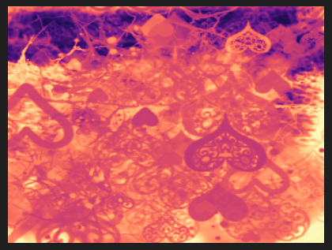

Graphics programming using [Magnum](https://github.com/mosra/magnum).

Repository and examples forked from [Magnum Examples](https://github.com/mosra/magnum-examples). See for original information!

In this branch, I have implemented procedural LUT tinting based on: https://blog.frost.kiwi/WebGL-LUTS-made-simple/

See code, usage and results in [src/lut/]( https://github.com/lorentzo/magnum-graphics/tree/lut/src/lut).

inferno:

magma:

plasma:

viridis:

