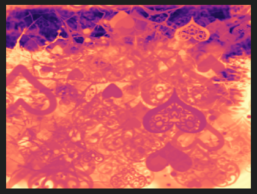
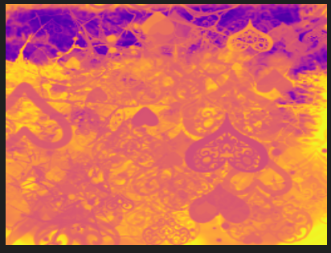
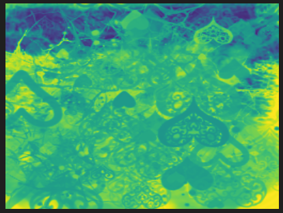

# LUT Example

Using procedural LUTs for tinting.

Based on: https://blog.frost.kiwi/WebGL-LUTS-made-simple/

### Results

inferno:

magma:

plasma:

viridis:

### Usage

1. Position terminal in: `src/lut/`
2. Type: `mkdir build`
3. Type: `cd build`
4. Type: `cmake ..`
5. Type: `make -j7`
6. Run `./magnum-lut ../texture.tga`
